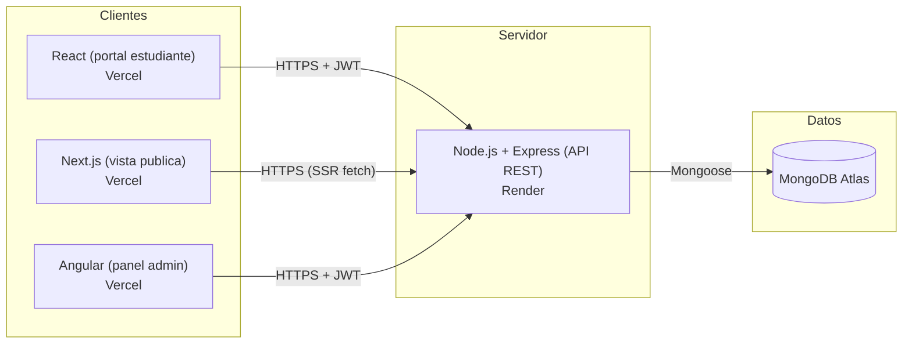

# Arquitectura del sistema

## Diagrama general

## Distribución por capa

| Capa | Tecnología | Responsabilidad |
|---|---|---|
| Portal del estudiante | React + Vite + React Router + Context API | Login, catalogo, inscripcion, "mi cuenta" |
| Vista pública | Next.js (App Router) | Catalogo y detalle de curso con SSR, sin necesidad de login |
| Panel administrativo | Angular (standalone components) | CRUD de cursos y usuarios, protegido por rol admin |
| API REST | Node.js + Express + Mongoose | Autenticación JWT, autorización por rol, reglas de negocio, seguridad |
| Persistencia | MongoDB Atlas | Colecciones `users`, `courses`, `enrollments` |

## Por qué se dividió en 3 frontends

Cada frontend cumple un propósito distinto pedido por la rúbrica del curso:

- **Next.js**: se usa para la vista pública porque necesitábamos SSR (los cursos se
  renderizan en el servidor en cada request con `cache: "no-store"`), así cualquier
  visitante ve el catálogo actualizado sin loguearse y sin esperar a que cargue JS en el navegador.
- **React**: es la SPA del estudiante. Aquí sí tiene sentido manejar estado en el cliente
  (Context API para la sesión) porque el usuario interactúa bastante (inscribirse, ver su cuenta).
- **Angular**: se usa solo para el panel admin, separado de la app del estudiante, con
  formularios reactivos y guards que restringen el acceso solo a rol `administrador`.

## Autenticación y autorización

1. El usuario envía `email`/`password` a `POST /api/auth/login`.
2. El backend valida con `bcrypt.compare` y firma un JWT con `{ id, nombre, rol }`.
3. El token se guarda en `localStorage` en cada frontend (React: `AuthContext`, Angular: `AuthService`).
4. Cada request protegido manda `Authorization: Bearer <token>`.
5. `auth.middleware.js` verifica el token; `role.middleware.js` verifica que el rol tenga permiso
   para la ruta (ej: solo `administrador` puede crear/editar/eliminar cursos y usuarios).
