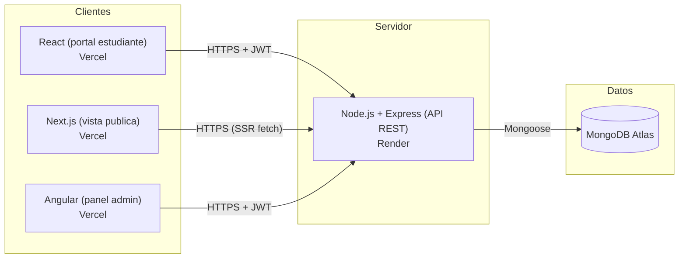

# Arquitectura del sistema

## Diagrama general

## Distribución por capa

| Capa | Tecnología | Responsabilidad |
|---|---|---|
| Portal del estudiante | React + Vite + React Router + Context API | Login, catalogo, inscripcion, "mi cuenta" |
| Vista pública | Next.js (App Router) | Catalogo y detalle de curso con SSR, sin necesidad de login |
| Panel administrativo | Angular (standalone components) | CRUD de cursos y usuarios, protegido por rol admin |
| API REST | Node.js + Express + Mongoose | Autenticación JWT, autorización por rol, reglas de negocio, seguridad |
| Persistencia | MongoDB Atlas | Colecciones `users`, `courses`, `enrollments` |

## Por qué se dividió en 3 frontends

Este proyecto utiliza tres aplicaciones porque cada una está pensada para un tipo de usuario diferente.

Next.js muestra el catálogo público de cursos sin necesidad de iniciar sesión.
React es el portal del estudiante, donde puede inscribirse, consultar sus cursos y administrar su cuenta.
Angular está destinado al panel de administración, desde donde se gestionan usuarios y cursos.

De esta forma, cada aplicación tiene una responsabilidad clara y el proyecto resulta más organizado y fácil de mantener.

## Autenticación y autorización
La autenticación se realiza mediante JWT. Cuando el usuario inicia sesión, el backend valida sus credenciales y genera un token que se almacena en el navegador. Ese token se envía en cada petición protegida y el servidor verifica tanto la identidad del usuario como su rol, permitiendo que solo los administradores accedan a las funciones de gestión.
