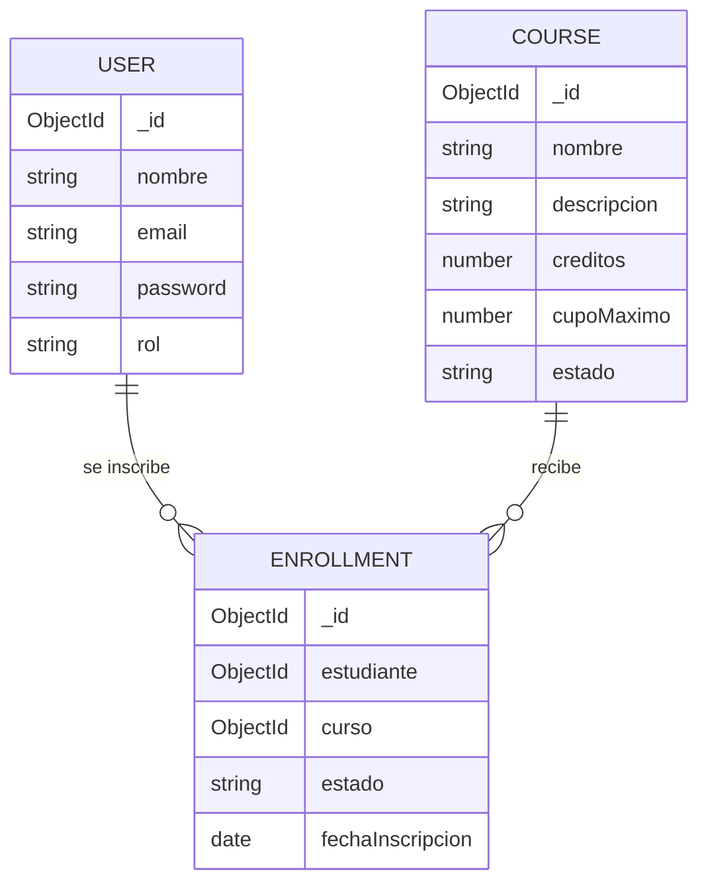

# Modelo de datos (MongoDB / Mongoose)

## Colección `users`

| Campo | Tipo | Detalle |
|---|---|---|
| `nombre` | String | requerido |
| `email` | String | requerido, único |
| `password` | String | requerido, se guarda con hash bcrypt (10 rounds) |
| `rol` | String (enum) | `administrador` \| `docente` \| `estudiante`, default `estudiante` |
| `createdAt` / `updatedAt` | Date | timestamps automáticos |

## Colección `courses`

| Campo | Tipo | Detalle |
|---|---|---|
| `nombre` | String | requerido |
| `descripcion` | String | requerido |
| `creditos` | Number | requerido |
| `cupoMaximo` | Number | requerido |
| `estado` | String (enum) | `activo` \| `inactivo`, default `activo` |
| `createdAt` / `updatedAt` | Date | timestamps automáticos |

## Colección `enrollments`

| Campo | Tipo | Detalle |
|---|---|---|
| `estudiante` | ObjectId | referencia a `User` |
| `curso` | ObjectId | referencia a `Course` |
| `estado` | String (enum) | `inscrito` \| `retirado`, default `inscrito` |
| `fechaInscripcion` | Date | default `Date.now` |

## Relación entre colecciones

